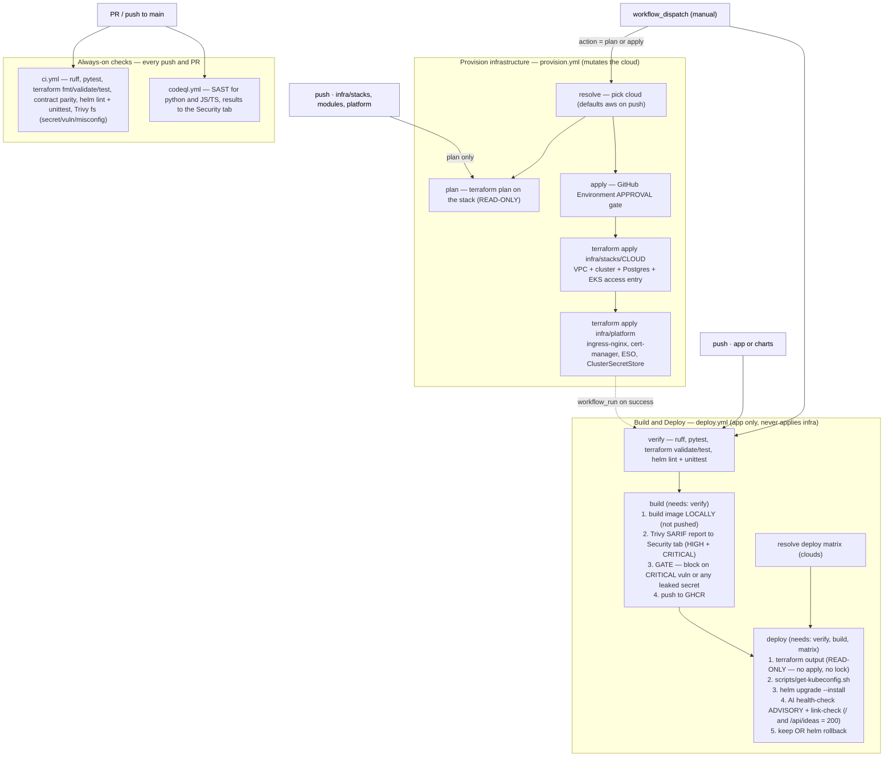

# Idea Board

A tiny, boring, **cloud-agnostic** web app that does one thing well: list ideas and let
you add new ones. The app itself is deliberately dull — the interesting part is
*everything around it*. Idea Board is a reference implementation for shipping the same
workload to **AWS or GCP** (or a third cloud you add yourself) from a single codebase,
with an **AI-assisted delivery pipeline** whose suggestions are always validated and
human-approved before anything runs.

- **App:** FastAPI backend + React/Vite/TypeScript frontend + PostgreSQL.
- **Packaging:** Docker images published to GHCR, deployed with a Helm chart.
- **Infra:** Terraform modules with an *identical input/output contract* per cloud.
- **AI:** three Claude-powered helpers (health-check, env-gen, plan-explain) that
  **propose → validate against JSON Schema → wait for a human → then a deterministic
  tool executes**. The LLM never runs raw commands and never sees cloud credentials.

> **Live app (AWS EKS):** <http://a0153a2195c6c44ecb638ff3b4ba0dcb-1786836222.us-east-1.elb.amazonaws.com/>
>
> **Backend API:** <http://a0153a2195c6c44ecb638ff3b4ba0dcb-1786836222.us-east-1.elb.amazonaws.com/api/ideas>
>
> Served on the load balancer's own hostname — **no domain required** (the ingress runs as
> an HTTP catch-all; set the `INGRESS_HOST` repo variable to pin a real domain + TLS).
> Shipped by the `Build & Deploy` pipeline; the frontend calls the API **same-origin** at `/api`.

---

## Table of contents

- [Architecture](#architecture)
- [Run locally with Docker Compose](#run-locally-with-docker-compose)
- [Cloud-Agnostic Approach](#cloud-agnostic-approach)
- [CI/CD pipelines](#cicd-pipelines)
- [Deploy to a cloud](#deploy-to-a-cloud)
- [AI Integration](#ai-integration)
- [Security: how we build and deploy safely](#security-how-we-build-and-deploy-safely)
- [Repository layout](#repository-layout)
- [Further reading](#further-reading)

---

## Architecture

There are two clean planes. The **portable plane** (app + Helm chart + Kubernetes
add-ons + AI tooling) is byte-for-byte identical on every cloud. The **cloud-specific
plane** (a thin Terraform stack per cloud, plus one auth shim script) is the only place
provider knowledge is allowed to live.

```
                          ┌──────────────────────────────────────────────────────────┐
                          │                    GitHub Actions CI/CD                    │
                          │  ci.yml · codeql.yml · provision.yml · deploy.yml          │
                          │  (full flowchart + dependencies: see "CI/CD pipelines")    │
                          │                                                            │
   PR / push ──► CI+CodeQL┤  lint • tests • tf validate/test • helm • Trivy fs • SAST  │
                          │                                                            │
   infra push /dispatch ─►│  provision.yml: tf PLAN on push · tf APPLY when approved   │
                          │    stacks/$CLOUD (VPC+cluster+DB)  +  infra/platform add-ons│
                          │                                                            │
   app push /dispatch ───►│  deploy.yml:  verify ─► build(scan-before-push) ─► deploy: │
                          │    read tf outputs ─► get-kubeconfig ─► helm upgrade ─►     │
                          │    AI health-check (advisory) + link-check ─► keep/rollback │
                          └───────────────────────────┬──────────────────────────────┘
                                                       │  kubeconfig + OIDC (no static keys)
                                                       ▼
   ┌───────────────────────────────────  Kubernetes cluster (EKS or GKE)  ───────────────────────────────────┐
   │  namespace: idea-board                                                                                   │
   │                                                                                                          │
   │        Internet                                                                                          │
   │           │                                                                                              │
   │           ▼                                                                                              │
   │   ┌───────────────┐   TLS via cert-manager (letsencrypt)                                                 │
   │   │ ingress-nginx │◄────────────────────────────────────────┐                                           │
   │   └──────┬────────┘                                          │                                           │
   │          │ Ingress (host: ingress.host, className: nginx)    │                                           │
   │   ┌──────┴─────────────────┐                                 │                                           │
   │   ▼                        ▼                                 │                                           │
   │ ┌──────────────┐     ┌──────────────┐        ┌──────────────────────────┐                               │
   │ │ frontend Svc │     │  backend Svc │        │  pre-install/upgrade Job  │                               │
   │ │  :80 (nginx) │     │   :8000      │        │  "alembic upgrade head"   │                               │
   │ └──────┬───────┘     └──────┬───────┘        │  (backend image)          │                               │
   │        │ Deployment         │ Deployment     └───────────┬──────────────┘                               │
   │        ▼                    ▼  + HPA                      │                                              │
   │ ┌──────────────┐     ┌──────────────┐                    │                                              │
   │ │ frontend pods│     │ backend pods │────────────────────┼──────────────┐                               │
   │ └──────────────┘     └──────┬───────┘                    │              │                               │
   │                             │  DATABASE_URL from Secret "idea-board-db"  │                               │
   │                             │                            │              │                               │
   │                    ┌────────┴────────────┐               │              │                               │
   │                    │ Secret idea-board-db│◄──────────────┘              │                               │
   │                    └────────┬────────────┘   materialized by            │                               │
   │                             │                                           │                               │
   │                    ┌────────┴─────────────────┐   External Secrets Operator                             │
   │                    │ ExternalSecret           │   ClusterSecretStore "cloud-secrets"                    │
   │                    │ idea-board-db            │   remote key: idea-board/db                             │
   │                    └────────┬─────────────────┘                         │                               │
   └─────────────────────────────┼───────────────────────────────────────────┼──────────────────────────────┘
                                 │  (pulls password from cloud secret store)  │  (network egress to managed DB)
                                 ▼                                            ▼
                 ┌───────────────────────────────┐        ┌──────────────────────────────────────┐
                 │ Cloud Secret Store             │        │  Managed PostgreSQL                    │
                 │ AWS Secrets Manager / GCP      │        │  AWS RDS / GCP Cloud SQL   :5432       │
                 │ Secret Manager  key idea-board/db│      │  db: ideas                             │
                 └───────────────────────────────┘        └──────────────────────────────────────┘
```

A deeper narrative — data flow, request lifecycle, and the reasoning behind each
boundary — lives in [`docs/ARCHITECTURE.md`](docs/ARCHITECTURE.md).

---

## Run locally with Docker Compose

You do **not** need any cloud account, Kubernetes, or Terraform to run the whole app
locally. Docker Compose brings up Postgres, the backend (which runs the Alembic
migration on start), and the frontend.

**Prerequisites:** Docker Engine + the Docker Compose v2 plugin.

```bash
# 1. Clone and enter the repo
git clone https://github.com/OWNER/idea-board.git
cd idea-board

# 2. (optional) copy the example env; the compose file already has sane defaults
cp .env.example .env

# 3. Build and start db + backend + frontend
docker compose up --build
```

That's it. Compose wires the three services together using these exact values (from the
shared contract — do not change them for local runs):

| Service    | Port (host→container) | Key environment                                                        |
|------------|-----------------------|------------------------------------------------------------------------|
| `db`       | `5432 → 5432`         | `POSTGRES_USER=ideas`, `POSTGRES_PASSWORD=ideas`, `POSTGRES_DB=ideas`   |
| `backend`  | `8000 → 8000`         | `DATABASE_URL=postgresql+psycopg://ideas:ideas@db:5432/ideas`           |
| `frontend` | `80 → 80`             | `VITE_API_BASE_URL=http://localhost:8000`                               |

Then open:

- **Frontend:** <http://localhost> (nginx serving the built React app)
- **Backend API:** <http://localhost:8000/api/ideas>
- **Liveness:** <http://localhost:8000/healthz> · **Readiness:** <http://localhost:8000/readyz>

Quick smoke test from the shell:

```bash
# List ideas (empty array on a fresh DB)
curl -s http://localhost:8000/api/ideas

# Create an idea (201 Created + the created row)
curl -s -X POST http://localhost:8000/api/ideas \
  -H 'Content-Type: application/json' \
  -d '{"content": "Ship the thing"}'
```

Common Makefile shortcuts (see [Makefile](Makefile)):

```bash
make up      # docker compose up --build -d
make logs    # tail all service logs
make test    # run the backend test suite
make down    # docker compose down -v (also drops the local DB volume)
```

To tear everything down and reclaim the volume: `make down` (or `docker compose down -v`).

---

## Cloud-Agnostic Approach

The whole design splits into a **portable plane** that never knows which cloud it's on,
and a **thin cloud-specific plane** that is the *only* place provider APIs appear.

### Portable vs cloud-specific plane

| Concern | Portable (identical everywhere) | Cloud-specific (the only deltas) |
|---------|--------------------------------|----------------------------------|
| Application | `app/backend`, `app/frontend` — 12-factor, zero cloud awareness | — |
| Packaging | Docker images on GHCR | — |
| Deploy unit | Helm chart `charts/idea-board` (all templates, `values.yaml`) | `values-aws.yaml` / `values-gcp.yaml` (storageClass + LB annotations only) |
| Cluster add-ons | `infra/platform`: ingress-nginx, cert-manager, ESO, the chart | one ClusterSecretStore provider block (var-selected) |
| Infra shape | Terraform **module contract** (same inputs/outputs) | `infra/modules/{aws,gcp}/*` implementations; `infra/stacks/{aws,gcp}` |
| Secrets | Kubernetes Secret `idea-board-db` + ExternalSecret | which cloud secret store backs it |
| Cluster auth | — | `scripts/get-kubeconfig.sh` (one `case` branch per cloud) |
| AI tooling | `ai/healthcheck`, `ai/envgen`, `ai/explain` | — |
| CI/CD | `.github/workflows/*` | a single `cloud` input |

The rule of thumb: **if a file mentions a specific cloud, it belongs in the cloud-specific
column — and there should be very few of them.**

### The Terraform module contract

Every cloud implements the *same three modules* with *identical inputs and outputs*. The
stack (`infra/stacks/<cloud>`) wires them the same way regardless of provider; only the
implementation inside `infra/modules/<cloud>/*` differs.

**network** — `infra/modules/<cloud>/network`
```hcl
inputs  { name, region, cidr }
outputs { network_id, subnet_ids (list), private_subnet_ids (list) }
```

**cluster** — `infra/modules/<cloud>/cluster`
```hcl
inputs {
  name
  region
  k8s_version
  node_size    # one of "small" | "medium" | "large"
  node_count
  network      # object from the network module's outputs
}
outputs {
  cluster_name
  kube_host
  kube_ca_cert   # base64
  oidc_provider
}
```

**database** — `infra/modules/<cloud>/database`
```hcl
inputs {
  name
  engine_version
  size          # "small" | "medium" | "large"
  storage_gb
  network
  allowed_cidrs # list
}
outputs {
  db_host
  db_port
  db_name
  db_secret_ref # points at idea-board/db in the cloud secret store
}
```

Because the signatures match, `infra/stacks/aws` and `infra/stacks/gcp` are nearly
identical: each declares a `cloud` variable, calls `network → cluster → database`, and
exposes `kube_host`, `kube_ca_cert`, `cluster_name`, and `db_host`.

### T-shirt sizing

Callers never name a machine type. They ask for `small`, `medium`, or `large`, and each
cloud module translates internally. This keeps the *intent* portable and hides the
provider's SKU vocabulary.

| Size   | AWS cluster node | GCP cluster node   | AWS database   | GCP database   |
|--------|------------------|--------------------|----------------|----------------|
| small  | `t3.medium`      | `e2-medium`        | `db.t3.micro`  | `db-f1-micro`  |
| medium | `m5.large`       | `e2-standard-4`    | `db.t3.small`  | `db-g1-small`  |
| large  | `m5.2xlarge`     | `e2-standard-8`    | `db.t3.medium` | `db-custom-*`  |

`ai/envgen` emits only these three tokens, so AI-proposed sizing is portable by
construction.

### External Secrets Operator (ESO)

The database password is **never** written into Git, Terraform state files (as plaintext),
or Helm values. Instead:

1. The Terraform `database` module writes the password to the **cloud secret store**
   (AWS Secrets Manager / GCP Secret Manager) at the logical key `idea-board/db`, and
   returns a `db_secret_ref`.
2. `infra/platform` installs **External Secrets Operator** and a ClusterSecretStore named
   `cloud-secrets` (the only per-cloud difference is its auth/provider block).
3. The chart's `externalsecret-db` template declares an **ExternalSecret** named
   `idea-board-db` that references ClusterSecretStore `cloud-secrets` and remote key
   `idea-board/db`.
4. ESO materializes a Kubernetes **Secret** `idea-board-db` with key `DATABASE_URL`.
5. The backend Deployment and the Alembic migration Job read `DATABASE_URL` from that
   Secret.

Same flow, same names, on every cloud — only *where the secret physically lives* changes.

### Adding a 3rd cloud (Azure) — the shape of it

Because of the module contract, adding Azure is **additive**, not a rewrite. In short:

1. Implement `infra/modules/azure/{network,cluster,database}` honoring the exact
   input/output signatures above (AKS + Azure Database for PostgreSQL + VNet; map the
   t-shirt sizes to `Standard_*` VM sizes and Azure Postgres SKUs).
2. Add `infra/stacks/azure` mirroring the AWS/GCP stacks (declare `cloud`, wire the
   modules, expose the same four outputs). Use a partial backend for Azure Blob state.
3. Add a `gcp`/`aws`-style `case` branch to `scripts/get-kubeconfig.sh`
   (`az aks get-credentials …`).
4. Add a `cloud-secrets` provider option in `infra/platform` pointing at **Azure Key
   Vault**, and add `charts/idea-board/values-azure.yaml` (storageClass + LB annotations).
5. Add `azure` to the `cloud` input enum in `.github/workflows/deploy.yml`.

The application, chart templates, AI tooling, ESO wiring, and module *signatures* don't
change at all. The full, copy-pasteable walkthrough is in
[`docs/ADDING_A_CLOUD.md`](docs/ADDING_A_CLOUD.md).

### Honest note: where the abstraction leaks

Cloud-agnostic is a goal, not a lie. Real seams remain, and pretending otherwise would be
worse than naming them:

- **IAM / cluster-auth models genuinely differ.** EKS access entries, GKE Workload
  Identity, and AKS AAD integration are not the same thing. `scripts/get-kubeconfig.sh`
  papers over the *fetch*, but the *trust setup* (OIDC federation) is configured per cloud.
- **T-shirt sizes are approximations.** `t3.medium`, `e2-medium`, and a `Standard_*` VM
  are *similar*, not equal, in CPU/RAM/network/credit behavior. "Medium" performance will
  differ across clouds.
- **Managed Postgres has provider-specific knobs** (parameter groups, flags, maintenance
  windows, backup semantics, TLS enforcement). The module contract exposes the common 80%;
  the last 20% is deliberately not abstracted.
- **LoadBalancer + storage annotations leak into `values-<cloud>.yaml`.** That's the point
  of the overlay — but it *is* cloud-specific YAML you must maintain.
- **Secret store auth differs.** ESO gives us one API, but IRSA (AWS), Workload Identity
  (GCP), and Managed Identity (Azure) each need their own provider block.
- **Networking defaults differ** (AZ/zone counts, NAT, service ranges), so the same `cidr`
  input can produce subtly different topologies.
- **Quotas, regional availability, and pricing** are entirely provider-specific and not
  modeled here.

We contain these leaks to a handful of well-marked files rather than eliminating them —
which is the realistic definition of "cloud-agnostic."

---

## CI/CD pipelines

Delivery is split into **four workflows** so that *infrastructure* changes (rare, costly,
stateful) and *application* changes (frequent, idempotent) have separate lifecycles, blast
radii, and triggers. Infra is only ever **planned** automatically and **applied** behind a
human approval gate; the app pipeline never touches infra — it only *reads* the stack's
remote state.



**Job dependencies & the checks that gate each step**

| Workflow | Trigger | Jobs (dependency) | Gate / check |
|---|---|---|---|
| `ci.yml` | every push to `main` + every PR | `backend`, `terraform`, `helm`, `security`, `explain-plan` (parallel) | ruff + pytest; `tf fmt/validate` + `terraform test` + contract parity; helm lint + unittest; Trivy fs (secret **blocks**, vuln/misconfig report); AI plan-explain on PRs |
| `codeql.yml` | push/PR + weekly | `analyze` (matrix: python, js-ts) | SAST → Security tab |
| `provision.yml` | push on `infra/**` → **plan**; dispatch `action=apply` → **apply** | `resolve` → `plan`; `resolve` → `apply` | `apply` is `needs: resolve` (not `plan`) and sits behind a **GitHub Environment** approval; push can only reach `plan` |
| `deploy.yml` | push on `app/**`,`charts/**`; dispatch; `workflow_run` after provision | `verify` → `build` → `deploy`; `matrix` → `deploy` | **`build` needs `verify`** (no image is built unless lint/tests/tf/helm pass); **scan-before-push** gate inside `build`; **deploy** gate = helm rollout OK **and** public URL returns 200 (AI health-check is advisory) → else `helm rollback` |

Key design choices: **path filters** route infra vs app pushes to the right workflow;
`terraform apply` on a cluster never runs on a bare push (plan-only + approved apply);
the deploy job **reads** stack outputs instead of applying them, so an app release never
holds the infra state lock or needs infra-mutating IAM. Setup details (OIDC, repo
variables/secrets, the Environment gate) are in
[`docs/PIPELINE_SETUP.md`](docs/PIPELINE_SETUP.md).

---

## Deploy to a cloud

Deployment is driven by two GitHub Actions workflows —
[`provision.yml`](.github/workflows/provision.yml) (infra) and
[`deploy.yml`](.github/workflows/deploy.yml) (app) — see [CI/CD pipelines](#cicd-pipelines)
for the full flowchart. You pick a cloud; the pipelines do the rest. They are the same for
AWS and GCP; only a single `cloud` input changes.

### Prerequisites (one-time)

1. **Fork/own the repo** so images publish under
   `ghcr.io/<your-org>/idea-board-backend` and `…-frontend` (CI substitutes
   `github.repository_owner` for `OWNER`).
2. **Cloud account** with permission to create a VPC, a managed Kubernetes cluster
   (EKS/GKE), and a managed Postgres (RDS/Cloud SQL).
3. **OIDC trust** between GitHub Actions and your cloud (no long-lived keys):
   - **AWS:** an IAM role with a GitHub OIDC trust policy; ARN stored as a repo variable.
   - **GCP:** a Workload Identity Federation pool + service account.
4. **Remote Terraform state** (created out-of-band, names are **not** hardcoded — see
   [`infra/stacks/aws`](infra/stacks/aws) / [`infra/stacks/gcp`](infra/stacks/gcp)
   READMEs for the partial-backend config):
   - **AWS:** an S3 bucket + a DynamoDB table for state locking.
   - **GCP:** a GCS bucket.
5. **Repo secret** `ANTHROPIC_API_KEY` — **optional.** The AI health-check is *advisory*
   (the deterministic gate = healthy rollout + a live 200 from the public URL), so the app
   deploys fine without a key; provide one to enable the AI health verdict + PR plan-explain.

### Credentials via OIDC

The pipeline authenticates to the cloud using GitHub's OIDC token exchange — there are
**no static access keys** in the repo or in GitHub secrets. The workflow requests an
OIDC token, the cloud validates it against the trust policy you configured, and hands
back short-lived credentials scoped to the deploy. The LLM steps run in a separate,
credential-free context (see [AI Integration](#ai-integration)).

### Trigger it — two pipelines

**1. Provision the infra** (once per cluster, or when `infra/**` changes). Mutation is
deliberate and approval-gated — a push only ever *plans*:

```bash
# read-only plan (also runs automatically on any push touching infra/**)
gh workflow run provision.yml -f cloud=aws -f action=plan
# apply — pauses for approval if the "production" GitHub Environment has a required reviewer
gh workflow run provision.yml -f cloud=aws -f action=apply -f environment=production
```

`provision.yml` runs `terraform apply infra/stacks/$CLOUD` (network → cluster → database,
granting the deploy role cluster-admin via an EKS access entry) then
`terraform apply infra/platform` (ingress-nginx, cert-manager, ESO, `cloud-secrets`).

**2. Deploy the app** — runs automatically on any push to `app/**` or `charts/**`
(and after a successful provision via `workflow_run`), or on demand:

```bash
gh workflow run deploy.yml -f cloud=aws -f environment=production
```

`deploy.yml`, in order:

1. **`verify`** — ruff + pytest + `terraform validate`/`test` + helm lint/unittest.
   `build` *needs* this, so a failure means **no image is ever built**.
2. **`build`** — build the images **locally**, Trivy-scan them, and **push to GHCR only if
   the gate passes** (blocks on a fixable CRITICAL vuln or any leaked secret; HIGH findings
   are reported to the Security tab). *Scan before publish.*
3. **`deploy`** — read the stack's Terraform outputs **read-only** (no `apply`, no state
   lock) → `scripts/get-kubeconfig.sh $CLOUD` → `helm upgrade --install idea-board
   charts/idea-board -f values.yaml -f values-$CLOUD.yaml` → **gate**: keep the release
   iff the rollout succeeded **and** the public URL returns 200 on `/` and `/api/ideas`
   (the AI health-check runs **advisory**); otherwise `helm rollback` and post a summary.

### What actually changes between clouds

Almost nothing. The delta is intentionally tiny:

| What you change            | Where                                                      |
|----------------------------|------------------------------------------------------------|
| `cloud` input              | workflow dispatch (`aws` \| `gcp`)                         |
| Terraform stack            | `infra/stacks/aws` vs `infra/stacks/gcp` (same module API) |
| Helm values overlay        | `values-aws.yaml` vs `values-gcp.yaml` (storageClass + LB annotations only) |
| Kubeconfig fetch           | one `case` branch in `scripts/get-kubeconfig.sh`           |
| ClusterSecretStore auth    | one provider block in `infra/platform` (var-selected)      |

Everything else — the app image, the chart templates, the module input/output
signatures, the AI tooling — is identical. See the
[Cloud-Agnostic Approach](#cloud-agnostic-approach) below for the full contract.

---

## AI Integration

Idea Board uses **Claude via the official `anthropic` Python SDK** in three places. The
governing rule, stated in code comments and enforced with schemas, is:

> **AI PROPOSES → validate against a JSON Schema → a human approves → a deterministic
> tool executes.** We never execute raw LLM text, and the LLM never receives cloud
> credentials.

Why this shape? LLM output is probabilistic and occasionally wrong or adversarially
manipulable. By forcing every AI response through a strict JSON Schema and (for anything
that mutates infrastructure) a human gate, we get the *upside* of AI reasoning — reading
messy logs, translating intent, summarizing scary diffs — with **none** of the "the robot
ran `terraform destroy`" downside. The AI is an advisor, never an operator.

### The three features

| Feature | Path | Model | Input | Output (schema-validated) | Who acts |
|---------|------|-------|-------|---------------------------|----------|
| **Health-check** | [`ai/healthcheck`](ai/healthcheck) | `claude-sonnet-5` | rollout status, pod restart counts, `kubectl get events`, recent backend/frontend logs (gathered via `kubectl` subprocess) | `{healthy: bool, confidence: 0-1, reasons: [str], summary: str}` | **Advisory.** Emits a structured verdict to the run summary; the **deterministic** gate (healthy rollout **+** public URL returns 200) decides keep/rollback. Skipped cleanly when no `ANTHROPIC_API_KEY` is set. |
| **Env-gen** | [`ai/envgen`](ai/envgen) | `claude-opus-5` | an intent string, e.g. `"cost-sensitive staging"` or `"high-availability production"` | `{node_size (small\|medium\|large), node_count, backend_replicas, frontend_replicas, hpa_min, hpa_max}` — constrained to the t-shirt vocabulary with hard min/max guardrails | **Human.** Renders a tfvars + Helm values snippet and prints it for approval. Never auto-applies. |
| **Explain** | [`ai/explain`](ai/explain) | `claude-sonnet-5` | `terraform plan` output or a `helm diff` | plain-English summary that **flags destructive / replacement changes** | **Human.** Posted as a PR comment in CI (or printed locally). |

**Model choice.** Health-check and explain use `claude-sonnet-5` (fast, cheap, plenty for
classification/summarization). Env-gen uses `claude-opus-5` because turning fuzzy intent
into a safe, bounded config benefits from stronger reasoning.

**Guardrails, concretely.**
- Every response is parsed and validated with the `jsonschema` package against a checked-in
  schema (`ai/healthcheck/*.schema.json`, `ai/envgen/*.schema.json`). A response that
  doesn't validate is a hard failure, not a "best effort" parse.
- Env-gen additionally clamps to a hard min/max envelope, so even a valid-looking but
  reckless suggestion (e.g. `node_count: 500`) is rejected.
- The health-check is *advisory and bounded*: it reports a verdict but does **not** gate the
  release — the deterministic checks (helm rollout success + a live 200 from the public URL)
  make the keep/rollback call, so a wrong or unavailable AI answer can never block a good
  deploy (or wave through a broken one).
- Credentials never reach the model. `ANTHROPIC_API_KEY` is read from the environment;
  cloud creds live only in the OIDC-scoped deploy steps.

**Tangible value.** The health-check turns "did the deploy actually work?" from a human
squinting at `kubectl` output into an automatic, explainable verdict that rides alongside
the deterministic keep/rollback gate. Env-gen collapses "what size should staging be?" into an intent
sentence with a safe, reviewable answer. Explain makes Terraform plans legible so a
reviewer instantly sees the one line that says *replace database*.

Each `ai/*` directory ships its own `main` module, `requirements.txt` (`anthropic`,
`jsonschema`), a short README, and — for health-check and env-gen — its JSON Schema.

---

## Security: how we build and deploy safely

Security is applied in **layers, at every stage** — source → dependencies → build → deploy →
runtime — and wherever practical it *gates* (blocks the pipeline) rather than merely
reporting. Each table maps a **practice → the tool → the use case (threat it stops) → where
it's enforced**. Everything below is real and in the repo today.

### Source & development-time

| Practice | Tool | Use case — the threat it stops | Enforcement |
|---|---|---|---|
| **Secret scanning** | Trivy `fs --scanners secret` | Committing an API key / DB password / token into a public repo | **Blocks** CI (`ci.yml` `security` job) |
| **SAST (static code analysis)** | CodeQL (python + JS/TS) | Injection, SSRF, path traversal, unsafe deserialization in *our* code | `codeql.yml` → Security tab (push/PR/weekly) |
| **Dependency CVE scan** | Trivy `fs --scanners vuln` | Depending on a library with a known exploit | CI → Security tab |
| **Automated dependency updates** | Dependabot (pip · npm · docker · actions · terraform) | Drifting onto stale/vulnerable deps; slow patching | Weekly grouped PRs (terraform **major** bumps ignored — they need a deliberate migration) |
| **IaC / container / K8s misconfig** | Trivy `fs --scanners misconfig` | An open security group, a root container, a missing probe baked into Terraform/Dockerfile/chart | CI |
| **Quality gate before build** | `verify` job — ruff · pytest · `terraform test` · helm-unittest | Shipping code that doesn't lint, fails tests, or renders broken manifests | **`build` needs `verify`** — no image is built if it fails |
| **Infra correctness tests** | `terraform test` (mock providers) + contract-parity test | A module change that breaks the cloud-agnostic contract or the sizing map | CI + `verify` |

### Build & supply-chain

| Practice | Tool | Use case | Enforcement |
|---|---|---|---|
| **Scan *before* publish** | Trivy `image` (build locally → scan → push) | A vulnerable image reaching the registry / a cluster | **Blocks the push** on a fixable CRITICAL vuln or any leaked secret; HIGH → Security tab |
| **Base-image patching** | `apt-get upgrade` / `apk upgrade`, `setuptools` bump | Shipping known OS/language CVEs inherited from the base image | In the Dockerfiles; re-verified by the gate above |
| **Non-root containers** | dedicated unprivileged user (backend); nginx uid 101 + `setcap` (frontend) | Container-breakout / privilege-escalation blast radius | Baked into the images |
| **Deterministic, traceable tags** | `sha-<gitsha>` image tags | "which commit is actually running?" — provenance | Every build |
| **Keyless registry auth** | GHCR + the workflow's built-in `GITHUB_TOKEN` | Long-lived registry credentials to steal | No PAT stored |

### Deploy & runtime

| Practice | Tool | Use case | Enforcement |
|---|---|---|---|
| **Keyless cloud auth (OIDC)** | GitHub OIDC → AWS STS / GCP WIF | Stolen long-lived cloud access keys | **No static cloud keys** anywhere — short-lived per-run credentials |
| **Secrets out of Git/state/values** | External Secrets Operator + cloud secret store (IRSA / Workload Identity) | DB password leaking via Git, Terraform state, or Helm values | ESO syncs `idea-board/db` into a runtime-only K8s Secret |
| **Encrypted, locked remote state** | S3 (SSE) + DynamoDB lock | State tampering, concurrent-apply corruption, secrets-in-state exposure | Terraform backends |
| **Account-ID masking in public logs** | `TF_STATE_BUCKET` stored as a GitHub **Secret** | Leaking the AWS account ID (embedded in the bucket name) into public Actions logs | Masked secret, not a plain variable |
| **Human approval before infra mutation** | GitHub **Environment** protection on `provision.yml` `apply` | An accidental/malicious push destroying a cluster or DB | A push can only *plan*; *apply* waits for a reviewer |
| **Declarative least-privilege cluster access** | EKS Access Entries (`API_AND_CONFIG_MAP`) | Broad, unmanaged, imperative `aws-auth` cluster admin | Deploy role granted admin in Terraform (2-role split is the documented next step) |
| **Deterministic deploy gate + auto-rollback** | helm `--wait` rollout + post-deploy link check (`/` and `/api/ideas` = 200) | A broken or unreachable release staying live | Non-200 or failed rollout → automatic `helm rollback` |
| **Branch protection** | Repo ruleset | Force-deletion of `main` | Deletion blocked |
| **TLS termination** | cert-manager + Let's Encrypt (when a domain is set) | Plaintext traffic / MITM | ClusterIssuer in `infra/platform` |

### AI safety (the pipeline is AI-assisted)

The AI features follow **propose → schema-validate → deterministic action**: Claude never
receives cloud credentials or Kubernetes Secrets, never executes raw commands, and — for the
health-check — **never gates** the release (it's advisory). See [AI Integration](#ai-integration).

### Honest gaps (deliberately deferred)

Naming these *is* part of the posture, not a footnote:

- **The push gate blocks on CRITICAL + secrets, not every HIGH.** Blocking every fixable HIGH
  in transitive/base-image deps is an unsustainable treadmill; HIGH is reported to the Security
  tab for triage. Tighten to HIGH once the base images are on a clean patch cadence.
- **One broad deploy IAM role** is shared by provision and deploy; the least-privilege 2-role
  split (provision = mutate, app = read-state + connect) is documented in both workflows.
- **Trivy `vuln`/`misconfig` are report-mode in `ci.yml`** (the secret scan blocks). Flip to
  blocking once the first run's findings are triaged.
- **No image signing / provenance attestation** (cosign / SLSA) yet, and **no runtime
  NetworkPolicy / Pod Security enforcement** in the chart yet.

---

## Repository layout

```
idea-board/
├── app/
│   ├── backend/                 # FastAPI + SQLAlchemy 2.x + psycopg (v3), :8000
│   │   ├── app/                 # main app, models, routes, config (env-only)
│   │   ├── alembic/             # migration env + versions/ (creates table "ideas")
│   │   └── tests/               # backend test suite (make test)
│   └── frontend/                # React + Vite + TypeScript, nginx :80 in prod
│       ├── public/
│       └── src/                 # idea list + submit form, reads VITE_API_BASE_URL
├── charts/
│   └── idea-board/              # Helm chart (release "idea-board", ns "idea-board")
│       ├── templates/           # deployment-*, service-*, ingress, hpa-backend,
│       │                        #   externalsecret-db, migration-job, _helpers.tpl
│       ├── values.yaml          # base values
│       ├── values-aws.yaml      # overlay: storageClass + LB annotations
│       ├── values-gcp.yaml      # overlay: storageClass + LB annotations
│       └── Chart.yaml
├── infra/
│   ├── modules/
│   │   ├── aws/{network,cluster,database}   # EKS + RDS Postgres + VPC
│   │   └── gcp/{network,cluster,database}   # GKE + Cloud SQL Postgres + VPC
│   ├── stacks/
│   │   ├── aws/                 # provider "aws"; S3 + DynamoDB remote state
│   │   └── gcp/                 # provider "google"; GCS remote state
│   └── platform/                # portable add-ons: ingress-nginx, cert-manager,
│                                #   ESO, ClusterSecretStore, the idea-board chart
├── ai/
│   ├── healthcheck/             # CLI + module; *.schema.json; gates CI rollback
│   ├── envgen/                  # CLI; intent → constrained config; *.schema.json
│   └── explain/                 # CLI; plan/diff → plain-English, flags destructive
├── scripts/
│   ├── get-kubeconfig.sh        # POSIX sh; the ONLY cloud-specific auth shim
│   ├── bootstrap-aws.sh         # one-time: S3 state bucket + DynamoDB lock table
│   └── bootstrap-aws-oidc.sh    # one-time: GitHub OIDC provider + deploy/ESO IAM roles
├── .github/
│   ├── workflows/
│   │   ├── ci.yml               # push/PR: ruff + pytest + tf fmt/validate/test + helm + Trivy fs
│   │   ├── codeql.yml           # push/PR/weekly: SAST (python + JS/TS) → Security tab
│   │   ├── provision.yml        # infra: tf PLAN on push · gated tf APPLY (stacks + platform)
│   │   └── deploy.yml           # app: verify → build (scan-before-push) → deploy + gate/rollback
│   └── dependabot.yml           # weekly grouped dep-update PRs (pip/npm/docker/actions/terraform)
├── docs/
│   ├── ARCHITECTURE.md          # deeper architecture narrative
│   ├── ADDING_A_CLOUD.md        # step-by-step 3rd-cloud (Azure) guide
│   └── PIPELINE_SETUP.md        # OIDC + repo variables/secrets + Environment gate setup
├── docker-compose.yml           # db + backend + frontend for local dev
├── .env.example                 # documented env template
├── Makefile                     # up, down, logs, test, tf-init, deploy, destroy, lint
├── .gitignore
├── .dockerignore
└── README.md                    # you are here
```

---

## Further reading

- [`docs/ARCHITECTURE.md`](docs/ARCHITECTURE.md) — request lifecycle, data flow, and the
  reasoning behind each boundary.
- [`docs/ADDING_A_CLOUD.md`](docs/ADDING_A_CLOUD.md) — the full Azure onboarding walkthrough.
- Per-component READMEs live next to the code: `ai/*/README.md`,
  `infra/stacks/*/README.md`, and `infra/platform`.
